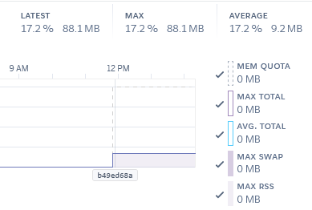

# Виконання лабораторної роботи №3: Дослідження і практична робота з квотами хмарних обчислень

## Стратегія використання квот хмарного сервісу Heroku

### 1. Розробка стратегії використання квот

Для ефективного використання квот Heroku необхідно:

1. **Проаналізувати потреби додатку:**
   - Оцінити очікуване навантаження (кількість користувачів)
   - Визначити вимоги до обчислювальних ресурсів
   - Спрогнозувати використання пам'яті та сховища

2. **Вибрати відповідний тип Dyno:**
   - Free Dyno (безкоштовний) - для розробки та тестування
   - Eco ($5/місяць) - для експериментів (є доступ до метрик)
   - Basic Dyno ($7/місяць) - для невеликих проектів з доступом до метрик
   - Standard/Performance Dyno - для виробничих додатків

3. **Моніторинг та оптимізація:**
   - Регулярно перевіряти метрики використання ресурсів
   - Налаштувати автоматичне масштабування (для платних планів)
   - Оптимізувати код для зменшення споживання ресурсів

### 2. Опис змінених квот

Було вирішено залишитися на basic плані:

1. **Обчислювальні ресурси:**
   - 512 MB RAM згідно з метриками більше ніж достатньо
  

   - Немає обмеження у вигляді "сплячого режим" (еко dyno засинають після 30 хвилин неактивності), що важливо для постійного швидкого відгуку
   - Сповіщення, які доступні тільки з профешинал плану непотрібні, оскільки застосунок не очікує великої кількості користувачів і проблем з ресурсами

2. **Моніторинг:**
   - Активовано доступ до метрик додатку

3. **Бази даних:**
   - Наразі не використовується

### 3. Розрахунок значень найважливіших квот

**Розрахунок необхідної пам'яті:**

- Базове використання додатком: 90 МБ
- Пікове навантаження (х2): 160 МБ
- Запас для непередбачуваних ситуацій (20%): 32 МБ
- **Загальна необхідна пам'ять: 192 МБ**

**Розрахунок необхідної кількості dyno:**

- Очікувана кількість одночасних користувачів: 100
- Середнє навантаження на одного користувача: 0.05 dyno
- **Необхідна кількість dyno: 5**

**Розрахунок витрат:**

- Hobby Dyno: $7/місяць × 5 = $35/місяць
- Hobby PostgreSQL: $9/місяць
- **Загальні витрати: $44/місяць**

## Практична реалізація

1. Перейдіть до панелі керування Heroku: <https://dashboard.heroku.com/>
2. Виберіть ваш додаток
3. Перейдіть до вкладки "Resources"
4. Змініть тип dyno з "Basic" на той, який вам потрібен.
5. Перейдіть до вкладки "Metrics" для моніторингу використання ресурсів
6. Налаштуйте сповіщення у вкладці "Settings" → "Notifications" (якщо ваш план дозволяє)

## Відповіді на контрольні питання

### 1. Які квоти впливають на роботу хмарного додатку?

На роботу хмарного додатку в Heroku впливають такі квоти:

- **Обчислювальні ресурси (dyno)** - визначають продуктивність та час відгуку додатку
- **Пам'ять** - обмежує кількість даних, які можуть бути оброблені одночасно
- **Сховище даних** - обмежує об'єм даних, які можна зберігати
- **Кількість підключень до бази даних** - впливає на масштабованість додатку
- **Пропускна здатність мережі** - впливає на швидкість обробки запитів

### 2. Які переваги має система квот у хмарі? Які є недоліки?

**Переваги:**

- Прозорість витрат та використання ресурсів
- Захист від непередбачуваних витрат
- Можливість масштабування відповідно до потреб
- Оптимізація використання ресурсів
- Запобігання монополізації ресурсів одним додатком

**Недоліки:**

- Обмеження функціональності на безкоштовних планах
- Необхідність постійного моніторингу використання ресурсів
- Можливі додаткові витрати при перевищенні квот
- Складність точного прогнозування необхідних ресурсів
- Залежність від політики ціноутворення провайдера

### 3. На що необхідно звернути увагу під час встановлення квот у хмарних додатках?

При встановленні квот необхідно звернути увагу на:

- **Характер навантаження додатку** (постійне чи пікове)
- **Критичність додатку** для бізнес-процесів
- **Бюджетні обмеження** проекту
- **Сезонність** використання додатку
- **Тенденції росту** кількості користувачів
- **Вимоги до часу відгуку** та доступності
- **Можливості автоматичного масштабування**
- **Резервні ресурси** для непередбачуваних ситуацій
- **Оптимальне співвідношення ціна/продуктивність**
