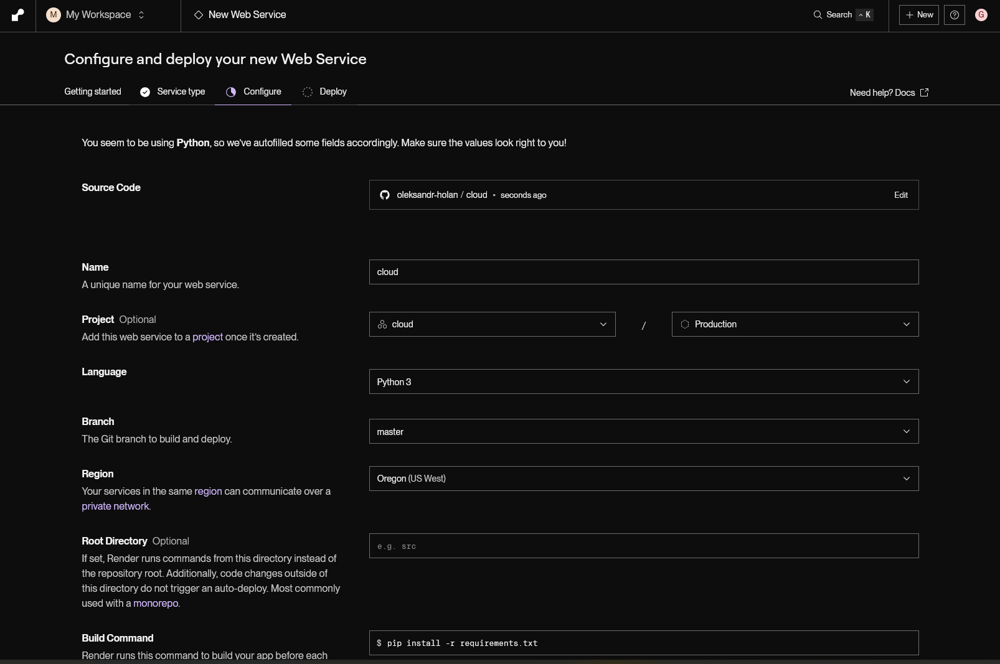
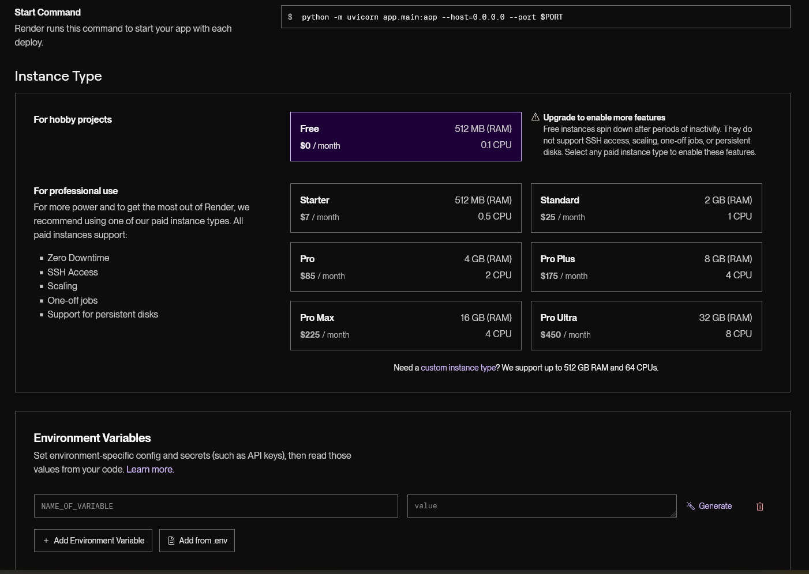
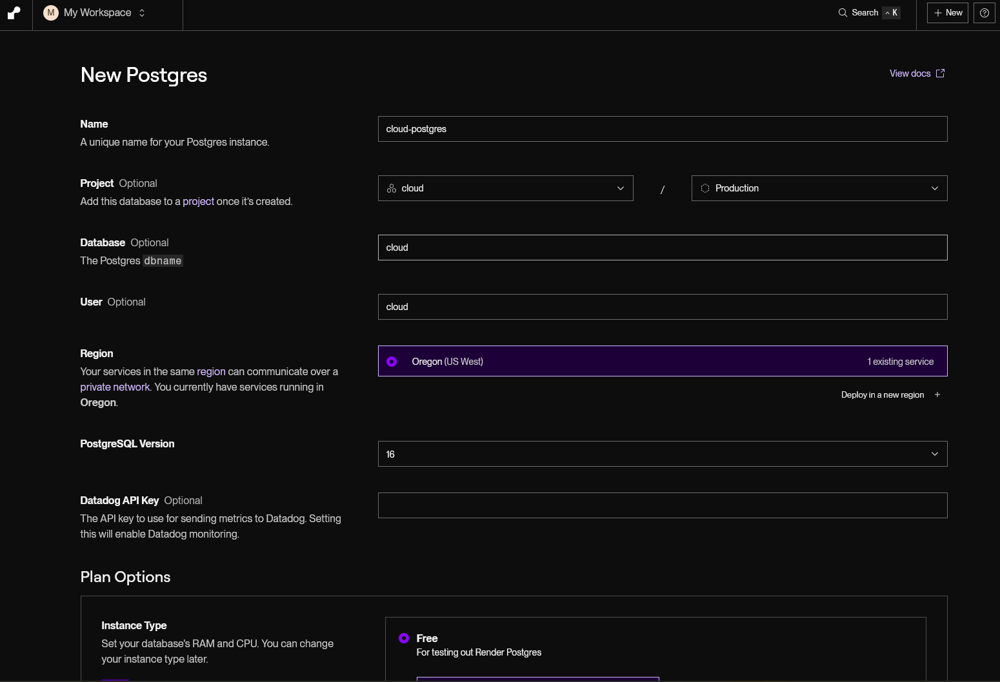
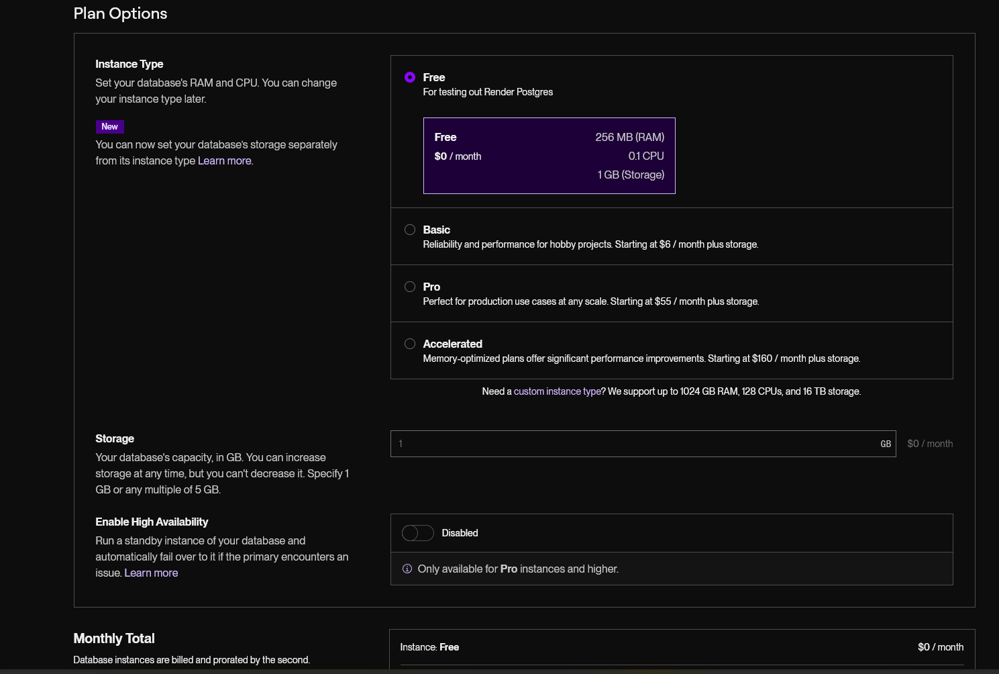

# Розробка хмарного додатку з PostgreSQL на Render

## 0. Інфра

### Створення проєкту

### Створення бази

Я допоможу вам модифікувати ваш FastAPI додаток для використання PostgreSQL на Render замість поточного in-memory сховища. Ось повне рішення:

## 1. Опис методів збереження даних

Для збереження даних у хмарному середовищі ми будемо використовувати:

- PostgreSQL базу даних на платформі Render
- SQLAlchemy як ORM для взаємодії з базою даних
- Pydantic моделі для валідації даних
- FastAPI для розробки API

## 2. Опис формату даних

Ми зберігатимемо дані про товари (Items) з такими полями:

- `id`: Унікальний ідентифікатор (integer, primary key)
- `name`: Назва товару (string, not null)
- `description`: Опис товару (string, nullable)
- `price`: Ціна товару (float, not null)
- `created_at`: Дата створення (datetime, not null)

## 3. Приклади збереження та отримання даних

Для взаємодії з базою даних ми будемо використовувати SQLAlchemy з такими операціями:

- **Створення**: `db.add(item)`, `db.commit()`
- **Читання**: `db.query(Item).all()`, `db.query(Item).filter(Item.id == item_id).first()`
- **Оновлення**: Оновлення об'єкта та `db.commit()`
- **Видалення**: `db.delete(item)`, `db.commit()`

## 4. Тестування роботи хмарного додатку

Для тестування додатку необхідно:

1. **Створити PostgreSQL базу даних у Render**:
   - Зайдіть на Render.com і створіть новий PostgreSQL сервіс
   - Зверніть увагу на URL для підключення до бази даних

2. **Налаштувати змінні середовища**:
   - Додайте змінну середовища `DATABASE_URL` зі значенням URL вашої PostgreSQL бази даних з Render

3. **Запустіть додаток на Render**:
   - Створіть новий сервіс Web Service
   - Налаштуйте як депендансі ваш PostgreSQL сервіс
   - Додайте ваш репозиторій з кодом
   - Додайте команду запуску: `uvicorn app:app --host 0.0.0.0 --port $PORT`

4. **Тестування API**:
   - Використовуйте вбудований Swagger UI за адресою `/docs`
   - Перевірте всі CRUD операції:
     - POST `/items/` для створення нового товару
     - GET `/items/` для отримання списку товарів
     - GET `/items/{id}` для отримання конкретного товару
     - PUT `/items/{id}` для оновлення товару
     - DELETE `/items/{id}` для видалення товару

## Відповіді на контрольні питання

### 1. Якими зберігаються дані у хмарній системі?

У хмарних системах дані зберігаються різними способами:

- **Реляційні бази даних**: PostgreSQL, MySQL, Oracle, SQL Server
- **NoSQL бази даних**: MongoDB, Cassandra, DynamoDB, Couchbase
- **Об'єктне сховище**: AWS S3, Google Cloud Storage, Azure Blob Storage
- **Файлові системи**: EFS, GlusterFS
- **Кеш-сховища**: Redis, Memcached
- **Time-series бази даних**: InfluxDB, TimescaleDB

Дані зазвичай розподіляються по різних серверах для забезпечення високої доступності та масштабованості.

### 2. Які переваги має система збереження даних у хмарі? Які є недоліки?

**Переваги:**

- **Масштабованість**: легко збільшувати обсяг сховища за потреби
- **Висока доступність**: кілька копій даних у різних місцях забезпечують безперервну роботу
- **Резервне копіювання**: автоматичне створення резервних копій
- **Географічна розподіленість**: дані можуть зберігатися ближче до користувачів
- **Зменшення витрат**: непотрібно купувати і підтримувати власне апаратне забезпечення
- **Автоматичні оновлення**: постачальник хмарних послуг забезпечує оновлення ПЗ

**Недоліки:**

- **Питання безпеки**: дані знаходяться на серверах третьої сторони
- **Залежність від підключення до інтернету**: потрібне стабільне з'єднання
- **Залежність від постачальника послуг**: складно змінити постачальника (vendor lock-in)
- **Законодавчі обмеження**: деякі типи даних не можна зберігати за межами країни
- **Вартість**: за великих обсягів даних може стати дорогим рішенням
- **Обмежений контроль**: менше можливостей налаштування інфраструктури

### 3. На що необхідно звернути увагу під час збереження даних у хмарних додатках?

При збереженні даних у хмарі необхідно звернути увагу на:

1. **Безпека даних**:
   - Шифрування даних під час передачі та зберігання
   - Контроль доступу та аутентифікація
   - Регулярний аудит безпеки

2. **Відповідність нормативним вимогам**:
   - GDPR, HIPAA, PCI DSS та інші стандарти
   - Географічні обмеження на зберігання даних

3. **Резервне копіювання та відновлення**:
   - Налаштування регулярних резервних копій
   - Перевірка процедур відновлення даних

4. **Продуктивність**:
   - Оптимізація запитів до бази даних
   - Правильний вибір типу сховища для різних даних
   - Використання кешування

5. **Вартість**:
   - Розуміння моделі оплати (за обсяг, за операції, за пропускну здатність)
   - Моніторинг витрат

6. **Масштабування**:
   - Архітектура, що підтримує горизонтальне масштабування
   - Автоматичне масштабування на основі навантаження

7. **Управління з'єднаннями**:
   - Правильна обробка пулу з'єднань
   - Обробка тимчасових збоїв (retry logic)

8. **Мережеве підключення**:
   - Оптимізація затримки мережі
   - Врахування проблем із з'єднанням
